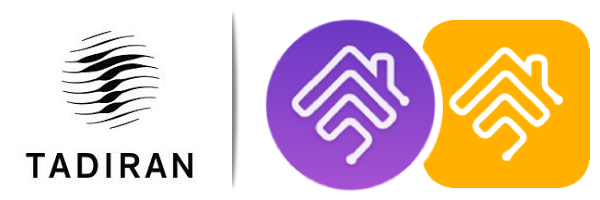
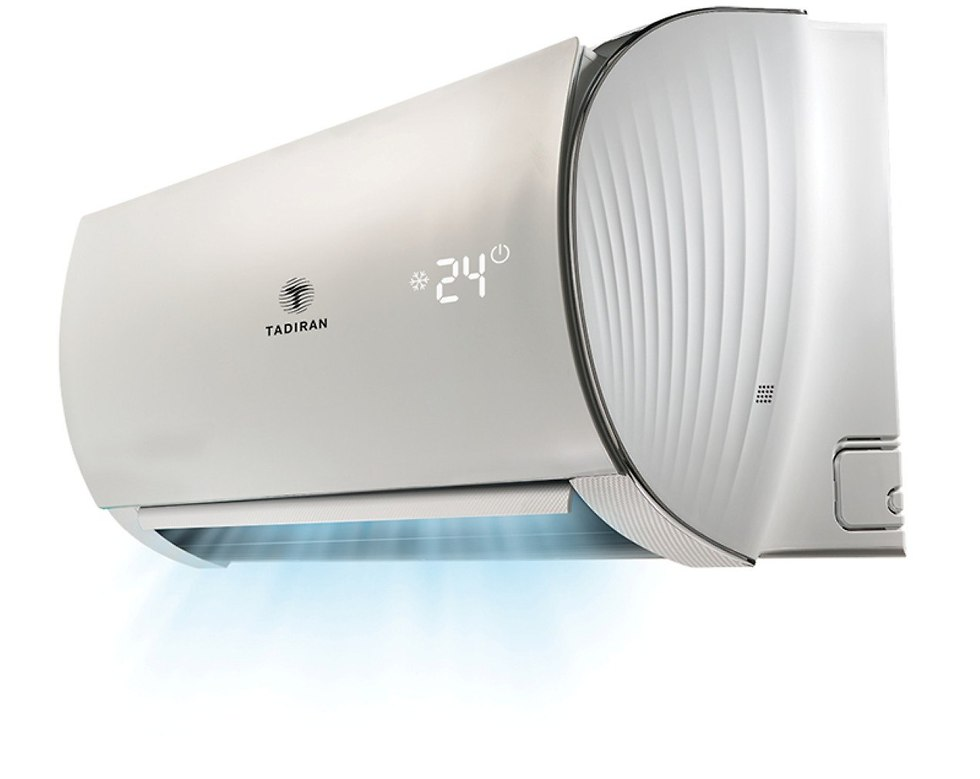
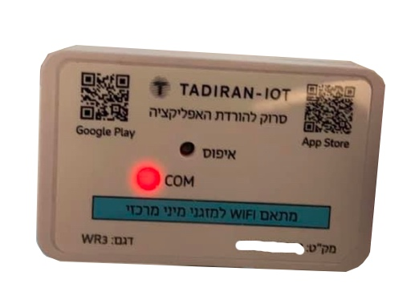

# homebridge-tadiran-ac

[](https://www.npmjs.com/package/homebridge-tadiran-ac)
[](https://www.npmjs.com/package/homebridge-tadiran-ac)<br>
<!-- [](https://github.com/homebridge/homebridge/wiki/Verified-Plugins) [](https://discord.gg/yguuVAX)<br>
[](https://plugins.hoobs.org?ref=10876) [](https://support.hoobs.org?ref=10876) -->


[Homebridge](https://github.com/nfarina/homebridge) plugin for Tadiran AC units controlled by the Tuya




#### Supported:
Tadiran IoT
<br>

Integration is known to work both with Tadiran app and Tuya Smart app, but will probably work with and Tuya clone apps.

### Requirements

 &nbsp;
 &nbsp;


check with: `node -v` & `homebridge -V` and update if needed


### Fan speeds & "AUTO" speed

Available fan speeds are: AUTO, LOW, MIDDLE, HIGH.
 Since HomeKit control over fan speed is with a slider between 0-100, the plugin converts the steps you have in the Tadiran app to values between 1 to 100, when 100 is highest and 1 is auto. setting fan speed to zero will shut off the device


### Finding your device ID and local key

#### Tuya IoT developer portal

The easiest way to find your local key is with the Tuya Developer portal.
If you have previously configured the built in Tuya cloud integration, or
localtuya, you probably already have a developer account with the Tuya app
linked.  Note that you need to use Tuya's own branded "Tuya Smart" or
"SmartLife" apps to access devices through the developer portal.  For most
devices, your device will work identically with those apps as it does with
your manufacturer's branded app, but there are a few devices where that is
not the case and you will need to decide whether you are willing to potentially
lose access to some functionality (such as mapping for some vacuum cleaners).

If you log on to your Developer Portal account, under Cloud you should
be able to get a list of your devices, which contains the "Device ID".
If you don't see them, check your server is set correctly at the top
of the page.  Make a note of the Device IDs for all your devices, then
select Cloud on the side bar again and go to the API Explorer.

Under "Devices Management", select the "Query Device Details in Bulk"
function, and enter your Device IDs, separated by commas.
In the results you should see your local_key.

The IP address you should be able to get from your router.  Using a
command line Tuya client like tuyaapi/cli or
[tinytuya](https://github.com/jasonacox/tinytuya) you may also be able
to scan your network for Tuya devices to find the IP address and also automate
the above process of connecting to the portal and getting the local key.

#### Finding device ids and local keys with tinytuya

You can use this component's underlying library [tinytuya](https://github.com/jasonacox/tinytuya) to scan for devices in your network and find the required information about them. In particular, you need to use this procedure to obtain the `node_id` value required to connect to hub-dependent devices.

Before running tinytuya's wizard you need to gather your API credentials so head to [Tuya's Developer Portal](https://iot.tuya.com) -> Cloud -> Development -> Open project and make a note of:

- Access ID/Client ID
- Access Secret/Client Secret

Next, go to the "Devices" tab and note your device id (any of them will work). Also note your region (eg. "Central Europe Data Center") in the combobox at the top right of the page.

Then, open a terminal in your HA machine and run:

```sh
python -m tinytuya wizard
```

Answer the following:

- Enter API Key from tuya.com: your "Access ID/Client ID"
- Enter API Secret from tuya.com: your "Access Secret/Client Secret"
- Enter any Device ID currently registered in Tuya App (used to pull full list) or 'scan' to scan for one: your device id
- Enter Your Region: your datacenter's region
- Download DP Name mappings? (Y/n): Y
- Poll local devices? (Y/n): Y

If your device supports local connections and is in the same network as the machine that tinytuya is installed on, this should find it and report its IP address.

In the `devices.json` file you will find the device id and device local key.

### Issues & Debug
If you experience any issues with the plugins please refer to the [Issues](https://github.com/nitaybz/homebridge-tadiran-ac/issues) tab or [Tadiran-AC Discord channel](https://discord.gg/yguuVAX) and check if your issue is already described there, if it doesn't, please create a new issue with as much detailed information as you can give (logs are crucial).<br>

if you want to even speed up the process, you can add `"debug": true` to your config, which will give me more details on the logs and speed up fixing the issue.

<br>

## Support homebridge-tadiran-ac

**homebridge-tadiran-ac** is a free plugin under the GNU license. it was developed as a contribution to the homebridge/hoobs community with lots of love and thoughts.
Creating and maintaining Homebridge plugins consume a lot of time and effort and if you would like to share your appreciation, feel free to "Star" or donate. 

<a target="blank" href="https://www.paypal.me/nitaybz"></a><br>
<a target="blank" href="https://www.patreon.com/nitaybz"></a><br>
<a target="blank" href="https://ko-fi.com/nitaybz"></a>


## Credits

CodeTheWeb - Original tuya repo
Amoo-Miki  - Tuya plugin core
Rayan Khan  - Tuya plugin improvements
